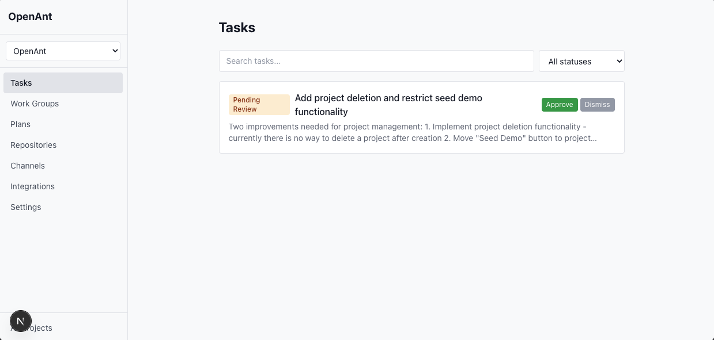
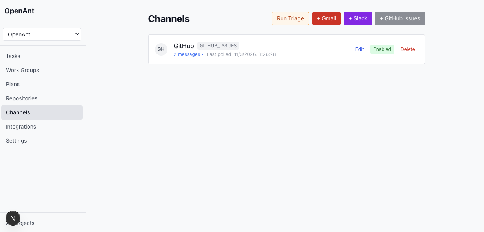
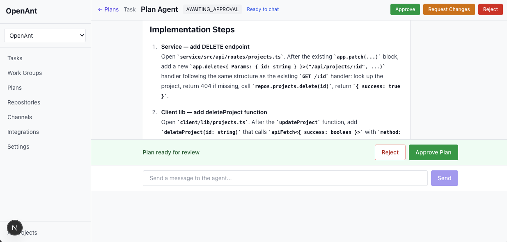
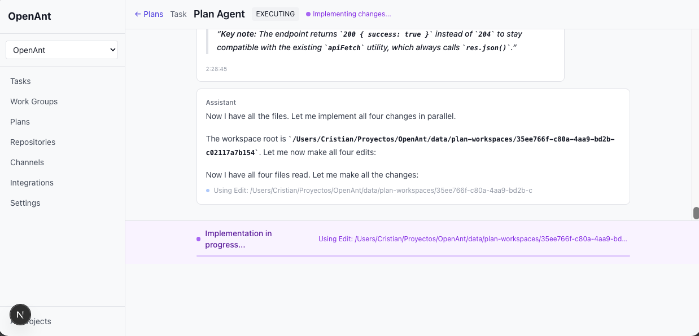

# OpenAnt

AI-powered task management and code generation platform. Collects messages from multiple channels (Gmail, Slack, GitHub Issues), triages them via LLM agents, generates implementation plans, and executes them autonomously by creating PRs on GitHub.

OpenAnt runs as a **single-user, self-hosted** application — no account registration or login required. Just start the server and begin creating projects.

## Disclaimer

This is a side project developed in my spare time, mainly for learning and experimentation.

Maintenance and updates may be irregular, but contributions are always welcome.  
If you’d like to help improve the project, feel free to open an issue or submit a pull request.

## Screenshots

**Tasks**


**Channels**


**Generated Plan**


**Execution in Progress**


## Quick Start

```bash
git clone https://github.com/CristianBB/OpenAnt.git
cd OpenAnt
pnpm install
cp .env.example .env
pnpm dev
```

- Backend API: http://localhost:3001
- Frontend: http://localhost:3000

## Project Structure

```
/service    Fastify backend API + scheduler + LLM orchestration
  /src
    /api          Route handlers and middleware
    /agents       LLM agent implementations (triage, task assignment, plan generation)
    /channels     Channel handlers (Gmail, Slack, GitHub Issues)
    /config       Zod-validated environment config
    /db           SQLite database, migrations (030)
    /demo         Demo data seeding
    /github       GitHub OAuth + Octokit wrapper
    /lib          Crypto, ID generation, logging, workspace manager
    /llm          LLM provider abstraction (OpenRouter + Mock)
    /repos        Repository pattern (interfaces + SQLite)
    /runner       Plan executor (clone, patch, commit, push, PR)
    /scheduler    In-process job scheduler with DB locking
    /semantic     Semantic search adapter (qmd fallback)
    /types        Entity types and enums
  /agents         Markdown instruction files for LLM agents
/client     Next.js 15 frontend
  /app            Pages (App Router)
  /components     Reusable UI components
  /lib            API client and type definitions
```

## Configuration

The only required environment variable is `OPENANT_DATA_DIR` (defaults to `./data`). All other configuration (API keys, OAuth, integrations) is managed through the web UI and stored encrypted in SQLite.

| Variable | Default | Description |
|----------|---------|-------------|
| `OPENANT_DATA_DIR` | `./data` | Directory for SQLite DB, logs, indexes |
| `API_PORT` | `3001` | Backend API port |
| `CLIENT_ORIGIN` | `http://localhost:3000` | CORS allowed origin |
| `LOG_LEVEL` | `info` | Pino log level |
| `NODE_ENV` | `development` | Environment mode |

## Architecture

### Encryption
- AES-256-GCM encryption for all stored secrets (API keys, OAuth tokens)
- Server secret auto-generated and stored in `OPENANT_DATA_DIR/.secret`

### Database
- SQLite with WAL mode and foreign keys
- 30 migration files, auto-applied on startup
- Repository pattern with interfaces and SQLite implementations

### Channels

Messages are collected from three channel types:

- **Gmail**: OAuth 2.0 per-project (user provides Google Cloud credentials). Polled every 2 minutes for unread messages.
- **Slack**: Socket Mode (persistent WebSocket). User provides Bot Token + App Token. Messages arrive in real-time.
- **GitHub Issues**: Polled every 2 minutes. Uses the project's GitHub OAuth token. Watches selected repositories for new issues and comments.

### Triage Pipeline

1. Incoming messages are stored as `source_messages` with status `PENDING`
2. Every 2 minutes, the triage scheduler batches up to 20 pending messages per project
3. The **Triage Agent** (LLM) classifies each message (BUG, FEATURE_REQUEST, IMPROVEMENT, IRRELEVANT) and decides:
   - **CREATE_TASK**: Creates a new task with status `PENDING_REVIEW`, groups related messages
   - **LINK_TO_EXISTING**: Links the message to an existing task, increments `requester_count`
   - **DISMISS**: Marks irrelevant messages as dismissed
4. Users review pending tasks in the UI: approve (with optional instructions) or dismiss

### LLM Integration
- Provider abstraction: OpenRouter (production) or Mock (demo)
- Four agents with markdown instruction files:
  - **Triage**: Classifies and routes incoming messages
  - **Task Assignment**: Groups and deduplicates tasks
  - **Repo Analysis**: Analyzes repository structure and conventions
  - **Plan Generation**: Creates implementation plans
- Per-project instruction overrides via UI

### Scheduler
- In-process with DB-based job locking (prevents duplicates)
- Jobs:
  - `poll-channels` (2min): Polls Gmail and GitHub Issues channels
  - `run-triage` (2min): Batches pending messages to triage agent
  - `check-merged-prs` (5min): Detects merged PRs, updates task status, closes GitHub issues
  - `reindex-qmd` (10min): Refreshes semantic search index
  - `index-repo-code` (30min): Indexes repository code

### Execution Pipeline
1. User approves a task (optionally with instructions)
2. Plan agent generates an implementation plan
3. User reviews plan — can approve, reject, or request changes (iterative)
4. On plan approval + execution:
   - Runner clones target repos via HTTPS with OAuth token
   - Creates feature branch `openant/{task-slug}-{shortId}`
   - Applies changes from the plan agent
   - Commits with task-title-based messages, pushes, creates PR via GitHub API
   - Logs streamed via SSE to frontend
5. Configurable parallelism per project (`max_parallel_runs`)

### Merged PR Handling
- Periodic job checks open PRs on GitHub
- When a PR is merged:
  - Task status updated to DONE
  - Related GitHub Issues closed with a comment referencing the PR

## Workflow

1. **Create a project** at http://localhost:3000/projects
2. **Connect integrations**: OpenRouter (LLM), GitHub (repos + PRs)
3. **Set up channels**: Gmail, Slack, or GitHub Issues at `/projects/{id}/channels`
4. **Configure settings**: Project rules, agent policy, parallel limit at `/projects/{id}/settings`
5. **Review tasks**: Incoming messages are triaged automatically. Approve or dismiss at `/projects/{id}/tasks`
6. **Review plans**: Plans are generated for approved tasks. Approve, reject, or request changes
7. **Watch execution**: Live logs via SSE at `/runs/{runId}`
8. **PRs created automatically** on GitHub with task context

### Integrations

**OpenRouter** (for real LLM responses):
- Go to project Integrations page
- Enter your OpenRouter API key
- Optionally configure assignment and planning model names

**Anthropic** (alternative LLM provider):
- Go to project Integrations page
- Enter your Anthropic API key
- Optionally configure model name

**GitHub** (for PR creation and GitHub Issues channel):
- Set up a GitHub OAuth App
- Configure Client ID, Secret, and Callback URL
- Connect via OAuth flow
- Select repositories to work with

**Gmail** (email channel):
- Create a Google Cloud project with Gmail API enabled
- Provide Client ID + Client Secret
- Complete OAuth flow to authorize email reading

**Slack** (real-time messaging channel):
- Create a Slack App with Socket Mode enabled
- Provide Bot Token (`xoxb-...`) and App Token (`xapp-...`)
- Connection starts automatically

## API Endpoints

### Projects
- `POST /api/projects` - Create project
- `GET /api/projects` - List projects
- `GET /api/projects/:id` - Get project
- `PATCH /api/projects/:id` - Update project (name, description, rules, policy, max_parallel_runs)

### Channels
- `GET /api/projects/:id/channels` - List channels
- `PATCH /api/channels/:channelId` - Update channel (enable/disable, config)
- `DELETE /api/channels/:channelId` - Delete channel
- `GET /api/channels/:channelId/messages` - List source messages (paginated)
- `POST /api/projects/:id/channels/gmail/auth-url` - Generate Gmail OAuth URL
- `POST /api/projects/:id/channels/gmail/callback` - Exchange Gmail OAuth code
- `POST /api/projects/:id/channels/slack/connect` - Connect Slack channel
- `POST /api/projects/:id/channels/github-issues/connect` - Connect GitHub Issues channel

### Integrations
- `PATCH /api/projects/:id/integrations/openrouter` - Save OpenRouter config
- `GET /api/projects/:id/integrations/openrouter` - Get OpenRouter config
- `PATCH /api/projects/:id/integrations/anthropic` - Save Anthropic config
- `GET /api/projects/:id/integrations/anthropic` - Get Anthropic config
- `GET /api/projects/:id/integrations/status` - Integration status
- `GET /api/projects/:id/integrations/github/status` - GitHub status

### GitHub OAuth
- `POST /api/projects/:id/github/connect` - Start OAuth
- `GET /api/github/callback` - OAuth callback
- `POST /api/projects/:id/github/disconnect` - Disconnect

### Repositories
- `GET /api/projects/:id/repositories` - List repos
- `GET /api/projects/:id/github-repos` - List GitHub repos
- `POST /api/projects/:id/repositories/select` - Select repo
- `POST /api/repositories/:id/analyze` - Analyze repo
- `PUT /api/repositories/:id/analysis-override` - Override analysis

### Tasks
- `GET /api/projects/:id/tasks` - List tasks (filter by status, search)
- `GET /api/tasks/:taskId` - Get task (includes links, impacts, plans, source messages)
- `PATCH /api/tasks/:taskId` - Update task
- `POST /api/tasks/:taskId/approve` - Approve task (with optional instructions)
- `POST /api/tasks/:taskId/dismiss` - Dismiss task
- `GET /api/tasks/:taskId/messages` - Get linked source messages
- `POST /api/tasks/:taskId/assign` - Run task assignment agent

### Work Groups
- `GET /api/projects/:id/work-groups` - List work groups
- `GET /api/work-groups/:groupId` - Get work group with items

### Plans
- `POST /api/tasks/:taskId/plans` - Generate plan for task
- `POST /api/work-groups/:groupId/plans` - Generate plan for group
- `GET /api/projects/:id/plans` - List plans
- `GET /api/plans/:planId` - Get plan
- `POST /api/plans/:planId/submit` - Submit draft plan for review
- `POST /api/plans/:planId/approve` - Approve plan
- `POST /api/plans/:planId/reject` - Reject plan (cleans up workspace + branches)
- `POST /api/plans/:planId/archive` - Archive completed/failed plan
- `POST /api/plans/:planId/request-changes` - Request plan revision with feedback
- `POST /api/plans/:planId/retry` - Retry failed plan
- `POST /api/plans/:planId/execute` - Execute approved plan

### Runs
- `GET /api/plans/:planId/runs` - List runs
- `GET /api/runs/:runId` - Get run with logs
- `GET /api/runs/:runId/stream` - SSE log stream

### Demo
- `POST /api/projects/:id/seed-demo` - Seed demo data

### Internal Tools (requires `x-internal-api-key` header)
- `POST /api/internal/tools/search-tasks`
- `POST /api/internal/tools/get-task`
- `POST /api/internal/tools/list-repos`
- `POST /api/internal/tools/get-repo-analysis`
- `POST /api/internal/tools/semantic-search`
- `POST /api/internal/tools/create-plan`
- `POST /api/internal/tools/update-plan`
- `POST /api/internal/tools/set-plan-status`

### Internal Repo Tools (requires `x-internal-api-key` header)
- `POST /api/internal/repo-tools/checkout`
- `POST /api/internal/repo-tools/read-file`
- `POST /api/internal/repo-tools/search`
- `POST /api/internal/repo-tools/apply-patch`
- `POST /api/internal/repo-tools/run-command`
- `POST /api/internal/repo-tools/commit`
- `POST /api/internal/repo-tools/push`
- `POST /api/internal/repo-tools/create-pr`

## Contributing

1. Fork the repository
2. Create a feature branch: `git checkout -b feature/my-feature`
3. Commit your changes: `git commit -m "Add my feature"`
4. Push to the branch: `git push origin feature/my-feature`
5. Open a Pull Request

## License

MIT
